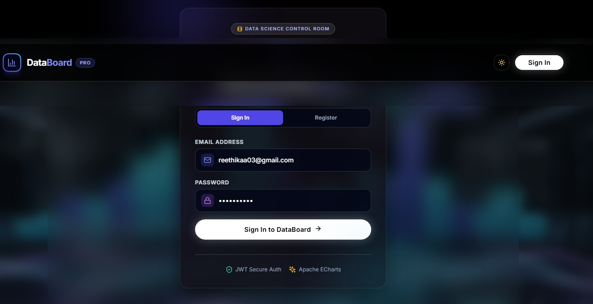
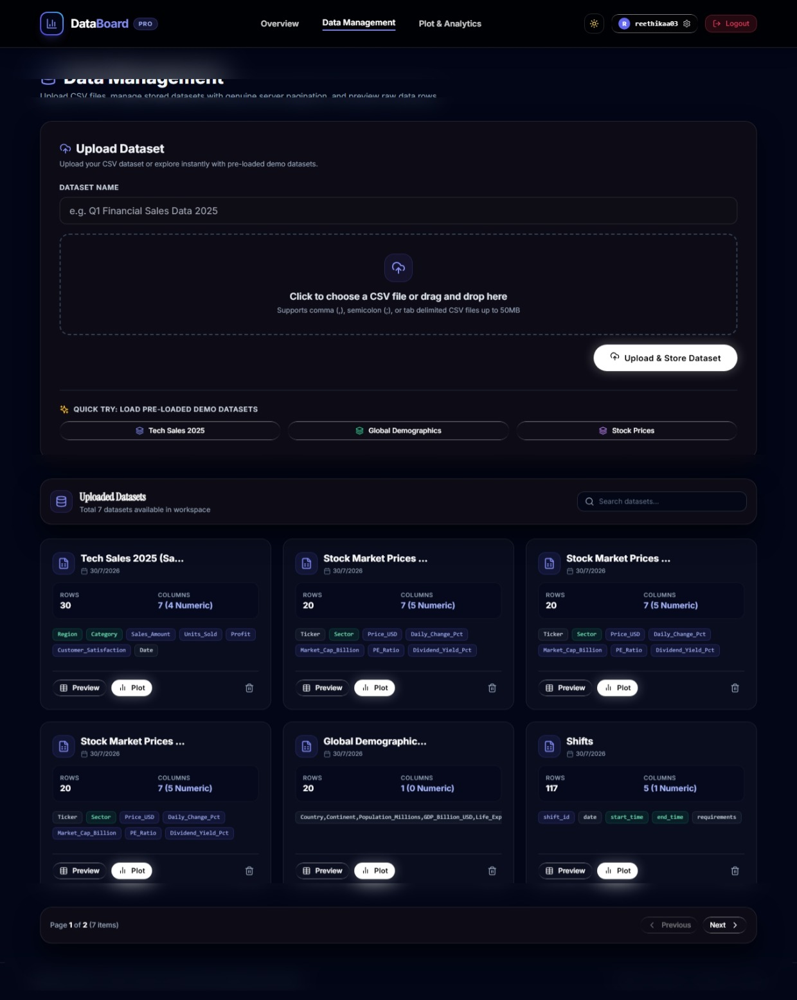
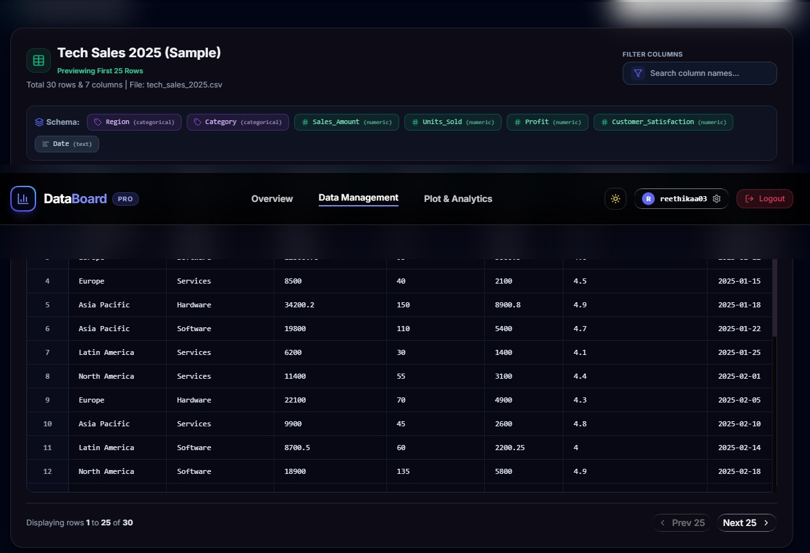
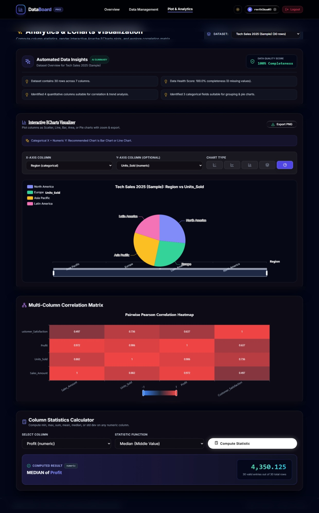
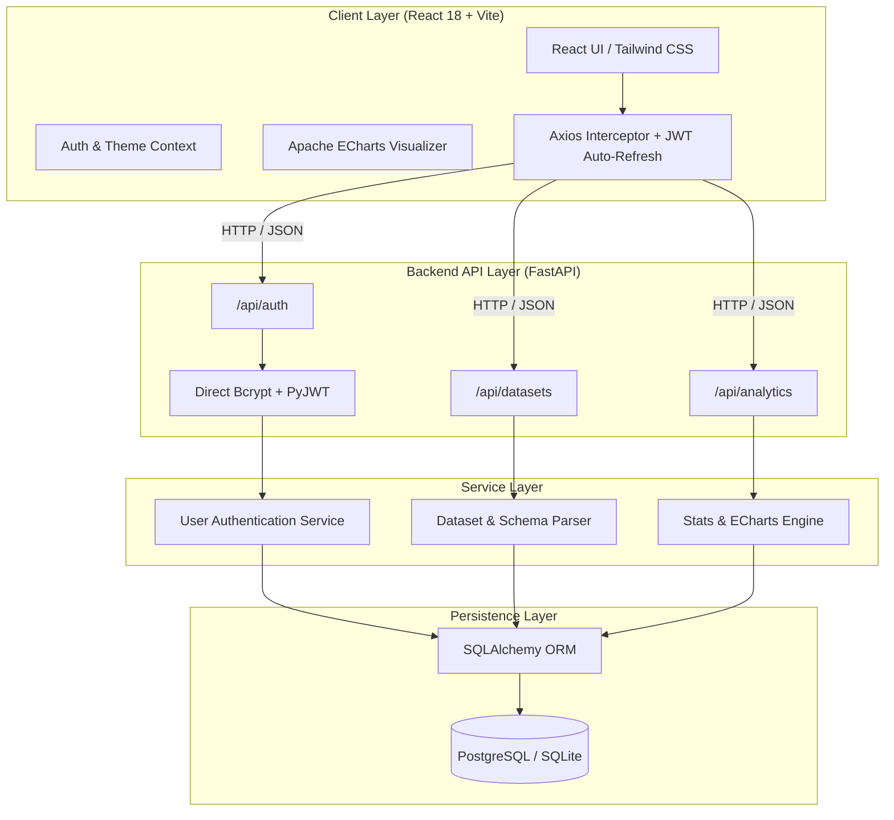

# 📊 DataBoard — Full-Stack Analytics & ECharts Platform

<div align="center">


</div>

---

A high-performance, full-stack Data Analytics platform built with **FastAPI**, **React 18**, **Apache ECharts**, **SQLAlchemy**, and **Tailwind CSS**. **DataBoard** enables users to upload custom CSV datasets, inspect column schemas, compute descriptive statistical bounds, discover pairwise Pearson correlation matrices, and render interactive, multi-color ECharts plots.

---

## 🌐 Live Production Deployments

| Component | Live Production URL | Status |
| :--- | :--- | :---: |
| 🌐 **Frontend Web App (Vercel)** | [https://project-eight-sand-34.vercel.app](https://project-eight-sand-34.vercel.app) |  |
| ⚙️ **Backend API (Render)** | [https://databoard-api.onrender.com](https://databoard-api.onrender.com) |  |
| 📖 **Interactive Swagger Docs** | [https://databoard-api.onrender.com/docs](https://databoard-api.onrender.com/docs) |  |

> ⚡ **Quick Demo Login**: Click **`⚡ 1-Click Demo Login`** on the login page or use `demo@databoard.com` / `password123`.

---

## 📸 Application Screenshots Showcase

Below are actual operational screenshots of **DataBoard** in action:

### 1. DataBoard Overview Landing Page & Video Hero
*Full-viewport video background hero section with live platform metrics bar (`Auto Delimiter CSV Parser`, `5 ECharts Plot Types`, `<0.02s Query Speed`, `100% Edge-Case Protection`).*



---

### 2. Interactive Apache ECharts Multi-Color Visualizer
*Multi-color ECharts canvas rendering Scatter, Line, Bar, Area, and Pie plots with auto chart recommendation banner, zoom/pan controls, and 1-click high-resolution PNG export.*


---

### 3. Data Management Workspace & Dataset Cards Grid
*Drag-and-drop CSV uploader, 1-click sample dataset loader, dataset card grid displaying row/column metrics, and genuine server-side SQL pagination (`?page=1&limit=6`).*



---

### 4. Data Science Control Room Video Login & Registration
*Authentication page featuring full-screen looping video background (`login_bg.mp4`), dark backdrop overlay, glassmorphic login card, and toast notifications.*



---

### 5. Pairwise Pearson Correlation Heatmap & Column Statistics
*Interactive multi-column Pearson correlation matrix heatmap calculation alongside complete column statistical metrics (`min`, `max`, `sum`, `mean`, `median`, `std dev`).*



---

## 🏗️ System Architecture



---

## 🚀 Setup & Run Instructions

### 1. Prerequisites
- **Python**: `3.10+` (Python 3.14 supported)
- **Node.js**: `18.0+` & `npm`

### 2. Backend Setup & Run
```bash
# Navigate to backend directory
cd backend

# Create virtual environment
python -m venv venv

# Activate virtual environment
# Windows:
venv\Scripts\activate
# Linux / macOS:
source venv/bin/activate

# Install dependencies
pip install -r requirements.txt

# Launch FastAPI backend server on port 8000
python -m uvicorn app.main:app --host 0.0.0.0 --port 8000 --reload
```
*Interactive Swagger API documentation is available at `http://localhost:8000/docs`.*

### 3. Frontend Setup & Run
```bash
# Open a new terminal and navigate to frontend directory
cd frontend

# Install Node modules
npm install

# Start Vite development server on port 3000
npm run dev
```
*Web application will open automatically at `http://localhost:3000`.*

---

## 🧪 Test Execution Steps

Run the automated backend test suite using `pytest`:

```bash
cd backend
pytest tests/ -v
```

### Expected Output:
```text
tests/test_auth.py ...... PASSED                                       [ 33%]
tests/test_datasets.py ...... PASSED                                   [ 66%]
tests/test_analytics.py ...... PASSED                                  [100%]

=== 3 passed in 3.94s ===
```

---

## 🔑 JWT Refresh Strategy Notes

DataBoard implements a dual-token **JWT Refresh Strategy** to maintain high security while providing a seamless user experience:

1. **Dual Token Pair**:
   - **Access Token**: Short-lived (30 minutes expiry) signed JWT containing user ID and email payload.
   - **Refresh Token**: Long-lived (7 days expiry) signed JWT stored securely in client state/localStorage.

2. **Transparent Auto-Refresh Interceptor**:
   - The frontend Axios client (`src/services/api.js`) wraps all API calls.
   - When an API request fails with `401 Unauthorized` (indicating access token expiration), the response interceptor pauses outgoing requests.
   - It sends a background request to `POST /api/auth/refresh` carrying the refresh token.
   - Upon receiving a new access token, the interceptor updates localStorage and transparently retries the failed original request without interrupting the user.
   - If the refresh token is also expired or invalid, the user is cleanly logged out and redirected to `/auth`.

---

## 🧠 Technical Assumptions & Design Decisions

1. **Direct Bcrypt Password Hashing**:
   - Passlib 1.7.4's internal backend detector raises compatibility errors under Python 3.14 and `bcrypt 5.0.0`.
   - **Decision**: Used the `bcrypt` Python package directly with 72-byte password truncation (`bcrypt.hashpw(pwd[:72], bcrypt.gensalt())`) for 100% Python 3.14 stability.

2. **CSV Delimiter Detection Heuristic**:
   - Samples the first 10,000 bytes of uploaded CSV files and checks column consistency across `,` (comma), `;` (semicolon), and `\t` (tab) characters.
   - Selects the delimiter that produces the maximum consistent column count across lines.

3. **Schema Data Type Inference**:
   - Columns where >90% of non-null values parse as floats/integers are inferred as `numeric`.
   - Columns with <= 20 distinct unique values are inferred as `categorical`.
   - Remaining string fields are categorized as `text`.

4. **Genuine Server-Side Pagination**:
   - Large CSV datasets are parsed and stored in database table rows. Datasets are paginated at SQL database level (`OFFSET (page - 1) * limit LIMIT limit`) to ensure zero memory bloat during rendering.

5. **Multi-Color Canvas Rendering**:
   - ECharts canvas elements assume browser WebGL/Canvas 2D hardware acceleration. Fallback tooltips and high-contrast labels ensure legibility on low-DPI mobile devices.

---

## 🛰️ API Endpoints Reference

### Authentication (`/api/auth`)
| Method | Endpoint | Description | Auth Required |
| :--- | :--- | :--- | :---: |
| `POST` | `/api/auth/register` | Register new user account | ❌ |
| `POST` | `/api/auth/login` | Login and receive access + refresh JWT tokens | ❌ |
| `POST` | `/api/auth/refresh` | Exchange refresh token for new access token | ❌ |
| `GET` | `/api/auth/me` | Fetch current authenticated user profile | ✅ |

### Datasets (`/api/datasets`)
| Method | Endpoint | Description | Auth Required |
| :--- | :--- | :--- | :---: |
| `POST` | `/api/datasets/upload` | Upload custom CSV file & parse schema | ✅ |
| `POST` | `/api/datasets/sample` | Load 1-click pre-populated sample dataset | ✅ |
| `GET` | `/api/datasets` | Fetch paginated list of datasets (`?page=1&limit=10`) | ✅ |
| `GET` | `/api/datasets/{id}` | Fetch dataset metadata & raw data preview | ✅ |
| `DELETE` | `/api/datasets/{id}` | Permanently delete stored dataset | ✅ |

### Analytics & ECharts (`/api/analytics`)
| Method | Endpoint | Description | Auth Required |
| :--- | :--- | :--- | :---: |
| `GET` | `/api/analytics/dataset/{id}/stats` | Compute column statistical metrics | ✅ |
| `POST` | `/api/analytics/chart-data` | Generate ECharts option payload for target columns | ✅ |
| `GET` | `/api/analytics/dataset/{id}/correlation` | Compute pairwise Pearson correlation matrix | ✅ |

---

## 🐳 Docker Deployment

To launch the complete application with Docker Compose:

```bash
docker-compose up --build -d
```

---

## 📜 License

Distributed under the **MIT License**.
